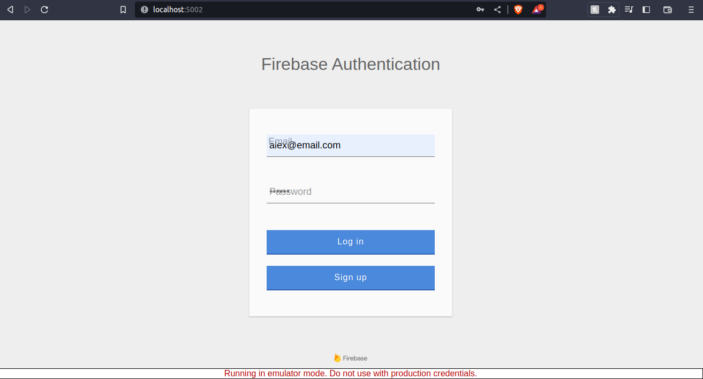
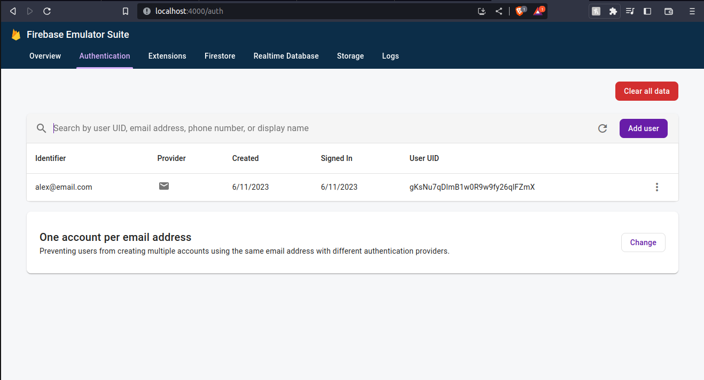

# Firebase Authentication


## Disclaimer

* De acordo com o tutorial que se encontra no ([link](https://firebase.google.com/docs/auth/web/start)), o html e css desse projeto foram retirados de lá. Todas as outras etapas foram realizadas por mim.


## Como usar

* Será necessário a instalação do Firebase CLI tools e Firebase Emulator suite ([instruções aqui](https://firebase.google.com/docs/emulator-suite/install_and_configure))


1. Clone localmente o repositório
2. Na pasta 'root' do repositório:
* Instale as dependencias

    ```bash
    $ npm install
    ```

*  Execute webpack para compilar o webpack do código:

    ```bash
    $ npx webpack
    ```

* Execute o Firebase Emulator para hostear o app localmente:

    ```bash
    $ firebase emulators:start
    ```

* Abra `http://localhost:5001` no browser, a porta pode mudar de 5001 para outra se ela já estiver em uso.

* Faça o 'Sing up' com um email e uma senha de exemplo.
  
  

* Se o 'Sign up' for bem sucedido aparecerá uma mensagem e você pode ir para `http://localhost:4000/auth` se quiser ver os usuários que foram criados no Firebase Authentication Emulator UI
  
* Você pode fazer um 'log out' que voltará a tela inicial, podendo assim fazer outro 'Sign up' ou fazer seu 'Login'.
